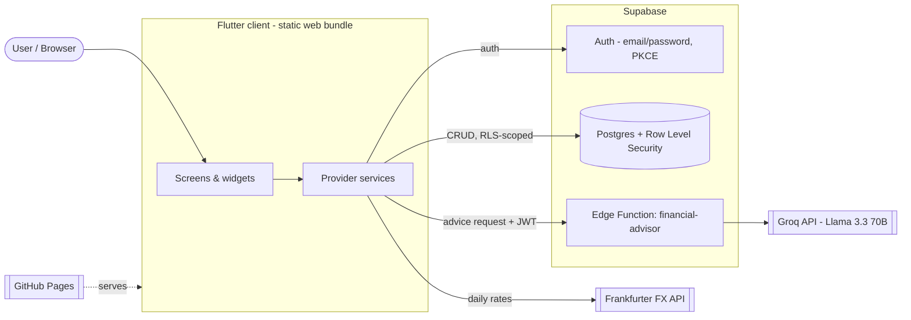
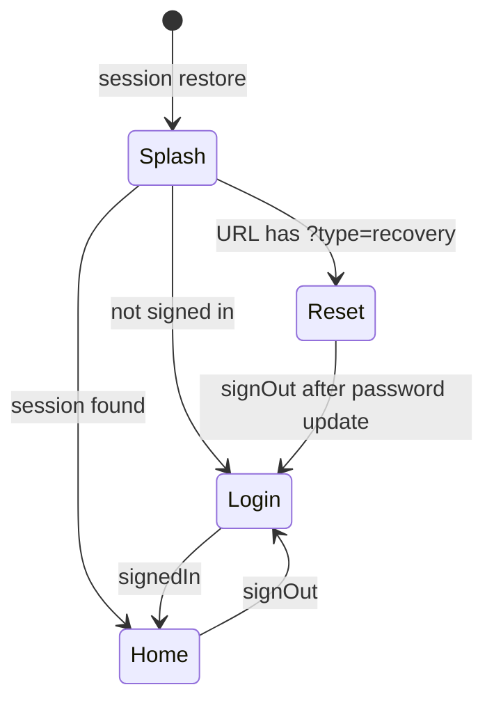
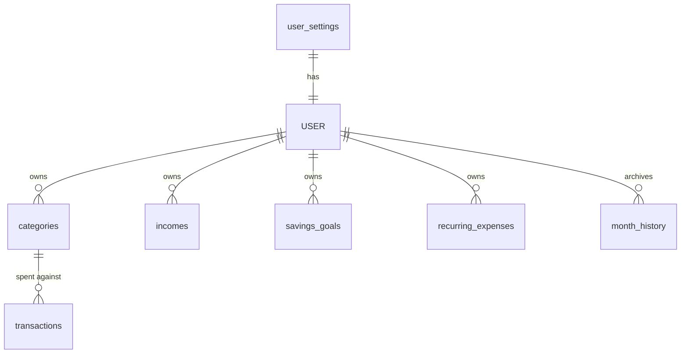
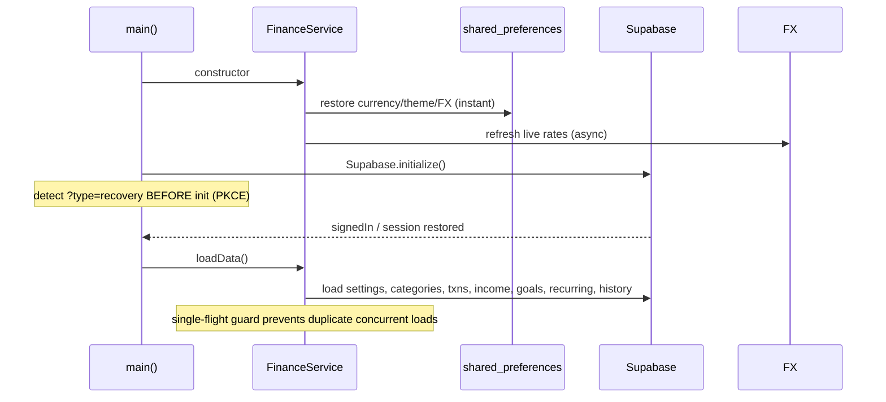
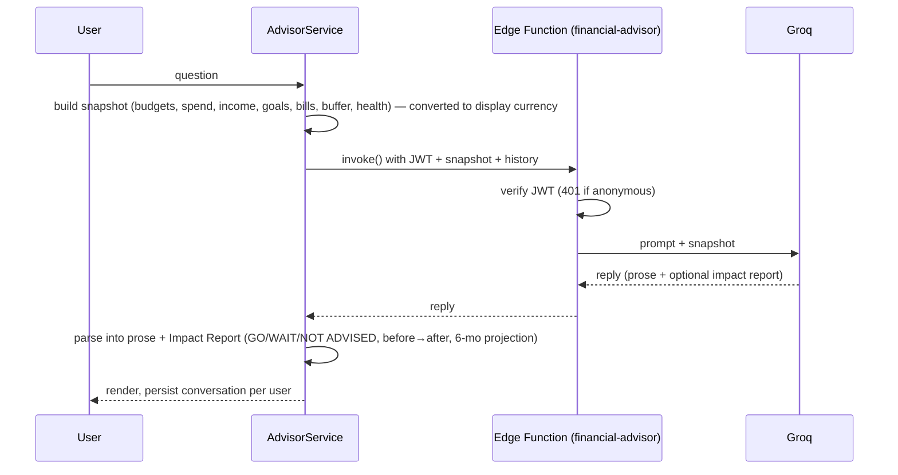
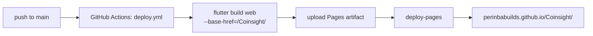

# Coinsight — Architecture

A detailed tour of how Coinsight is put together: the client, the backend, the
data model, the key runtime flows, and the design decisions (with tradeoffs)
behind them.

- **Client:** Flutter (Dart), compiled to a static web bundle (also runs on
  Android/iOS from the same code).
- **Backend:** Supabase — Postgres + Auth + a single Edge Function.
- **AI:** Groq (Llama 3.3 70B), reached only through the Edge Function.
- **Hosting:** GitHub Pages, built and deployed by GitHub Actions.

> Related docs: [`SRS.md`](SRS.md) (requirements) and [`SDD.md`](SDD.md)
> (design). This document is the system-level view that ties them together.

---

## 1. System context



Every arrow out of the client is either an authenticated Supabase call or a
public read (FX rates). The client never talks to Groq directly — that path is
brokered by the Edge Function so the model key stays server-side.

---

## 2. Technology choices

| Concern | Choice | Rationale |
|---|---|---|
| UI framework | Flutter (Dart) | One codebase → web + mobile; compiles to a static bundle that hosts free on GitHub Pages |
| State management | `provider` + `ChangeNotifier` | Small surface area; the app has three long-lived stores, not a complex graph |
| Charts | `fl_chart` | Donut (budgets/insights) and bar (history) charts, plus the advisor's projection line |
| Auth + DB | Supabase | Managed Postgres + auth with Row Level Security — per-user isolation with no server to operate |
| AI broker | Supabase Edge Function (Deno) | Keeps the LLM key off the client and enforces "signed-in only" before spending tokens |
| LLM | Groq — Llama 3.3 70B | Free tier, fast inference, good enough reasoning for grounded financial advice |
| FX rates | Frankfurter API | Free, keyless, CORS-friendly; static fallbacks keep conversion working offline |
| Local cache | `shared_preferences` | Instant restore of currency/theme on web refresh (localStorage) without a server round-trip |
| Config | `--dart-define` (`.env`) | Compile-time values; no bundled asset, so a missing `.env` never breaks the build |
| Hosting / CI | GitHub Pages + GitHub Actions | Free static hosting; every push to `main` rebuilds and redeploys |

---

## 3. Client architecture

### 3.1 Layers

```
main.dart                         app entry: init Supabase, mount providers, _AuthGate
  └── _AuthGate                   routes on auth state (splash / login / reset / home)
        └── HomeScreen            bottom-nav shell
              └── screens/*       Dashboard, Income, Goals, Advisor, Insights, History, …
                    └── widgets/* SummaryCard, BudgetChart, BudgetCategoryCard, …

services/    AuthService · FinanceService · AdvisorService   (ChangeNotifier stores)
models/      BudgetCategory · Transaction · Income · SavingsGoal · RecurringExpense · MonthSnapshot
theme/       AppTheme (light/dark ThemeData, colors, motion, route builders)
config/      SupabaseConfig (env-driven URL + anon key)
```

### 3.2 State management

Three `ChangeNotifier` services are provided once at the app root via
`MultiProvider` and live for the whole session:

| Service | Responsibility |
|---|---|
| **AuthService** | Wraps Supabase auth: `isLoggedIn`, `currentUser`, `displayName`, `signIn`/`signUp`/`signOut`/`resetPassword`/`updateProfile`. Notifies on every auth state change. |
| **FinanceService** | The single source of truth for all money data — categories, transactions, income, goals, recurring bills, month history, total budget. Also owns settings (currency, theme), FX rates, and the USD⇄display conversion helpers. |
| **AdvisorService** | Advisor chat state: builds the financial snapshot, calls the Edge Function, parses replies into prose + an Impact Report, and persists active/archived conversations per user. |

Screens read state with `context.watch<T>()` (rebuild on change) and fire
actions with `context.read<T>()`.

### 3.3 Navigation model — auth-state driven

`_AuthGate` swaps its child based on state flags rather than pushing routes for
auth transitions:



**Why:** if login used `Navigator.pushAndRemoveUntil`, `_AuthGate` could be torn
out of the tree, and a later `signedIn` event would have nothing to navigate.
Driving everything from a persistent gate keeps auth transitions race-free.
(Feature navigation — e.g. opening *Manage Budgets* — still uses normal
`Navigator.push`.)

---

## 4. Data model

All amounts are stored in **USD** (see §6). Every table is scoped by
`user_id` and protected by Row Level Security, so a user can only read/write
their own rows.

| Table | Holds |
|---|---|
| `user_settings` | Per-user settings: `total_monthly_budget`, `is_dark_mode`, `currency` |
| `categories` | Budget categories (name, icon, color, budget amount) |
| `transactions` | Expense records linked to a category |
| `incomes` | Income entries (source, amount, date) |
| `savings_goals` | Goals (target amount, saved amount, target date) |
| `recurring_expenses` | Repeating bills (amount, day-of-month, active flag) |
| `month_history` | Archived month snapshots (budget vs actual, per-category, transactions) |
| `budget_planner` | Next-month budget planning values |



---

## 5. Key runtime flows

### 5.1 Startup & data load



`loadData()` is guarded by an in-flight future so the two triggers (the login
screen and `_AuthGate`'s auth listener reacting to the same `signedIn` event)
don't double every network request.

### 5.2 Password reset (PKCE)

Supabase's PKCE flow returns a `?code=…` query param. The app appends
`?type=recovery` to its `redirectTo` and detects that **before**
`Supabase.initialize()` runs, so the recovery UI is shown before the code
exchange fires `passwordRecovery`. The auth subscription is created before the
early return in the recovery path, or the later `signOut` would be missed and
the user would be stuck on the reset screen.

### 5.3 AI Advisor request



The snapshot is sent in the **active display currency** so the model reasons in
the user's units and the numbers it returns render correctly with the currency
symbol.

---

## 6. Cross-cutting concerns

### 6.1 Currency & FX conversion

- **Base currency is USD.** Every stored amount is USD; the UI converts only at
  the display and input boundaries.
- `FinanceService` exposes `toDisplay(usd)` (× rate, for display) and
  `toBase(amount)` (÷ rate, for values the user types). Business logic
  (ratios, over-budget checks) stays in USD and is currency-agnostic.
- Rates come from the Frankfurter API on startup, cached in
  `shared_preferences`; sensible **fallback rates** (e.g. 1 USD ≈ ₹85) ship in
  code so conversion works offline / before the first fetch.

### 6.2 Persistence & the "don't clobber" rule

Settings live in Supabase (`user_settings`) for cross-device sync **and** in
`shared_preferences` for instant local restore. On load, a server currency
value is adopted only when it is actually present — a missing/null value can't
overwrite the locally-cached choice. This is what makes the currency selection
survive a web refresh even if the server row lags.

### 6.3 Budget lock

`isBudgetLocked => DateTime.now().day > 7`. From the 8th onward, budget editing
is disabled (add/edit/delete category and total). Enforced in the manage-budgets
screen, the category cards, and the dashboard banner, with a snackbar when a
locked control is tapped.

### 6.4 Theming

`AppTheme` defines light/dark `ThemeData`; `FinanceService.isDarkMode` drives
`MaterialApp.themeMode`. A single toggle (dashboard header) flips it; the choice
persists locally and to Supabase.

### 6.5 Security model

- **Row Level Security** isolates every user's rows server-side.
- The **anon key is public by design** (RLS-protected) — safe to ship in the
  client bundle. It is *not* a secret.
- The **Groq key never reaches the client**: it lives as a Supabase secret and
  is used only inside the Edge Function, which rejects anonymous callers (`401`).

### 6.6 Configuration

`SupabaseConfig` reads `SUPABASE_URL` / `SUPABASE_ANON_KEY` from `--dart-define`
(via `--dart-define-from-file=.env`), falling back to public defaults. Values
are compile-time constants, so there is no runtime `.env` asset to bundle and a
missing file never breaks the build. See [`.env.example`](../.env.example).

---

## 7. Deployment



- The workflow builds on **`pull_request`** too (compile-check) but only the
  **`deploy`** job runs on pushes to `main`.
- `--base-href="/Coinsight/"` matches the project-pages path; the built
  `index.html` therefore resolves assets under `/Coinsight/`.
- Pages source is set to **GitHub Actions** (not a branch folder), so the
  freshly built bundle is what gets served.

See [`.github/workflows/deploy.yml`](../.github/workflows/deploy.yml).

---

## 8. Directory map

```
lib/
├── main.dart                     # entry, Supabase init, providers, _AuthGate
├── config/supabase_config.dart   # env-driven URL + anon key
├── models/                       # BudgetCategory, Transaction, Income, SavingsGoal, …
├── services/
│   ├── auth_service.dart         # Supabase auth wrapper
│   ├── finance_service.dart      # all finance data + currency/FX + settings
│   └── advisor_service.dart      # advisor chat, snapshot, history
├── screens/                      # dashboard, income, goals, advisor, insights, history, auth/, …
├── widgets/                      # summary_card, budget_chart, budget_category_card, …
└── theme/app_theme.dart

supabase/functions/financial-advisor/index.ts   # JWT check + Groq proxy
.github/workflows/deploy.yml                     # build + deploy to Pages
docs/                                            # SRS, SDD, this file
```

---

## 9. Design decisions & tradeoffs

| Decision | Why | Tradeoff |
|---|---|---|
| Store amounts in USD, convert at the edges | Keeps every row currency-agnostic and all math simple | Switching currency re-scales *historical* values by today's FX rate, not the rate at entry time |
| Auth-state-driven gate (no manual nav for auth) | Avoids a torn-down gate missing a later `signedIn` | Slightly less obvious than imperative navigation |
| Local cache + "adopt server value only if present" | Currency/theme survive refresh even if the server row lags | Two places to keep in sync; local wins on conflict |
| Broker the LLM via an Edge Function | Keeps the model key server-side; enforces auth | One more hop; advisor needs the function deployed |
| Public anon key in the client | Standard Supabase model; RLS does the enforcement | The key is visible — acceptable, but stricter setups front everything with functions |
| Compile-time config via `--dart-define` | No runtime asset; build never breaks on a missing `.env` | Must pass the flag to override defaults |

---

## 10. Known limitations / future work

- **Currency is display-time, not per-entry** — no historical-rate accuracy.
- **Budget lock (after the 7th) is not configurable.**
- **Test coverage** exists for auth and month-snapshot logic but not yet for the
  newer currency-conversion and advisor paths.
- **FX rates** are best-effort (free feed + static fallback), fine for display,
  not for precise accounting.
- **Advisor cost/limits** ride the Groq free tier; heavy use would need a paid
  key and rate-limit handling beyond the current friendly-error fallback.
